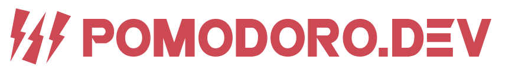
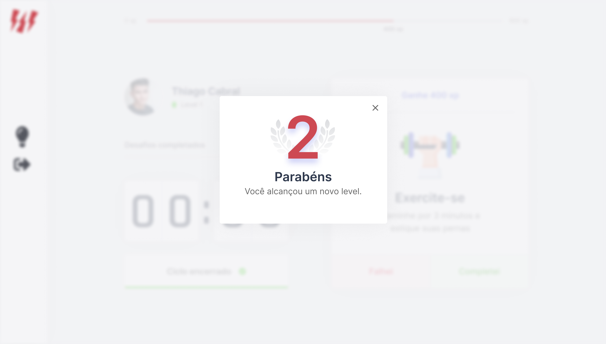

<p align="center">
  <a href="https://github.com/thsthiago/pomodoro.dev/blob/main/LICENSE">
    
  </a>

  <a href="https://github.com/thsthiago/pomodoro.dev/stargazers">
    
  </a>

  <a href="https://www.linkedin.com/in/thsthiago-cabral/">
    
  </a>

</p>

<h1 align="center">
    
</h1>

<h4 align="center"> 
	Veja o projeto online: <a href="https://pomodorodev.vercel.app/">Pomodoro.Dev</a>
</h4>

<p align="center">
 <a href="#-sobre-o-projeto">Sobre</a> •
 <a href="#-funcionalidades">Funcionalidades</a> •
 <a href="#-layout">Layout</a> • 
 <a href="#-como-executar-o-projeto">Como executar</a> • 
 <a href="#-tecnologias">Tecnologias</a> • 
 <a href="#-obrigado">Agradecimentos</a> • 
 <a href="#-autor">Autor</a> • 
 <a href="#user-content--licença">Licença</a>
</p>


## 💻 Sobre o projeto

O Pomodoro.Dev foi criado com base na [Técnica Pomodoro](https://brasilescola.uol.com.br/dicas-de-estudo/tecnica-pomodoro-que-e-e-como-funciona.htm), para a diminuição da ansiedade e ao **aumento do foco e concentração nas tarefas**, evitando o tempo desperdiçado e distrações.

Projeto desenvolvido durante a **NLW4 - Next Level Week 4** oferecida pela [Rocketseat](https://blog.rocketseat.com.br/).
O NLW é uma experiência online com muito conteúdo prático, desafios e hacks onde o conteúdo fica disponível durante uma semana.

---

## ⚙️ Funcionalidades

- [x] O usuário pode fazer login com o Username ou Username do Github:
  - [x] Username:
  - Salva apenas o nome cadastrado.
  - [x] Username Github:
  - Salva foto do perfil do Github.
  - Salva o nome cadastrado no Github.


- [x] Modo dark.
- [x] Iniciar um ciclo de 25 minutos.
- [x] Abadornar ciclo.
- [x] Dispara um efeito sonoro quando o ciclo chega ao fim.
- [x] No final do ciclo libera um novo desafio.
- [x] A cada desafio concluído o usuário ganha XP.
- [x] O usuário pode subir de nível completando desafios.
---

## 🎨 Layout

O layout da aplicação está disponível no Figma:

<a href="https://www.figma.com/file/zKd584T9maFD5x3CzkhIxK/Pomodoro.dev?node-id=160%3A2761">
  
</a>


### Web mobile

<p align="center">
  

  

  
</p>

### Web


<p align="center">
  

  
  
</p>


---

## 🚀 Como executar o projeto

### Pré-requisitos

- [x] [Git](https://git-scm.com)
- [x] [Node.js](https://nodejs.org/en/)

### 🧭 Rodando a aplicação web

```bash

# Clone este repositório
$ git clone https://github.com/thsthiago/pomodoro.dev.git

# Acesse a pasta do projeto no seu terminal/cmd
$ cd pomodoro.dev

```

**Rodando aplicação com yarn:**

```bash

# Instale as dependências
$ yarn add

# Execute a aplicação em modo de desenvolvimento
$ yarn dev

# A aplicação será aberta na porta:3000 - acesse:
$ http://localhost:3000

```

**Rodando aplicação com npm:**

```bash

# Instale as dependências
$ npm install

# Execute a aplicação em modo de desenvolvimento
$ npm run dev

# A aplicação será aberta na porta:3000 - acesse:
$ http://localhost:3000

```

---

## 🛠 Tecnologias

As seguintes ferramentas foram usadas na construção do projeto:

-   **[ReactJS](https://pt-br.reactjs.org/)**
-   **[NextJS](https://nextjs.org/)**
-   **[Axios](https://github.com/axios/axios)**
-   **[Yarn](https://yarnpkg.com/)**
-   **[React Font Awesome](https://fontawesome.com/how-to-use/on-the-web/using-with/react)**
-   **[JS Cookie](https://github.com/js-cookie/js-cookie)**


#### [](https://github.com/tgmarinho/Ecoleta#utilit%C3%A1rios)**Utilitários**

-   Protótipo:  **[Figma](https://www.figma.com/)**  →  **[Protótipo (pomodoro.dev)](https://www.figma.com/file/zKd584T9maFD5x3CzkhIxK/Pomodoro.dev?node-id=160%3A2761)**
-   Editor:  **[Visual Studio Code](https://code.visualstudio.com/)**  
-   Ícones:  **[Font Awesome](https://fontawesome.com/)**
-   Fontes:  **[Inter](https://fonts.google.com/specimen/Inter?query=Inter&preview.text_type=custom)**,  **[Rajdhani](https://fonts.google.com/specimen/Rajdhani?query=rajd&preview.text_type=custom)**


---

## 💜 Obrigado

Obrigado ao [Diego](https://blog.rocketseat.com.br/author/diego/) e a todos da equipe da [Rocketseat](https://blog.rocketseat.com.br/), por mais um NLW🚀 incrível!


## 👨🏽‍💻 Autor


 
 <br />
 <sub><b>Thiago Cabral</b></sub></a>
 <br />

[](https://www.linkedin.com/in/thsthiago-cabral/) 
[](mailto:thiagocabral477@gmail.com)

---

## 📝 Licença

Este projeto esta sobe a licença [MIT](./LICENSE).

Feito com ❤️ por Thiago Cabral 🚀
